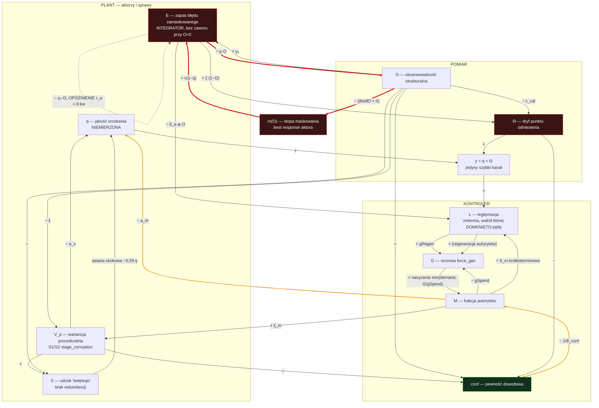

# AGENT C — 20-DYNAMICS (tor I, suwerenny)

Pętle sprzężenia, znaki, wzmocnienia, opóźnienia, warunki rozbiegania, atraktory, punkty interwencji.
Wszystkie wartości policzone z modelu `10-SPEC.md`.

---

## 1. Diagram pętli (znaki jawne)

Czerwona ścieżka `O → m → E → O` to `LOOP-C-01/02`: **jedyna pętla w układzie, która jest dodatnia, szybka i nieopóźniona**. Wszystko pozostałe albo jest wolniejsze, albo opóźnione, albo ujemne o wzmocnieniu przy granicy stabilności.

---

## 2. Katalog pętli

| ID | Zjawisko | Ścieżka | Znak | Wzmocnienie | Opóźnienie | Warunek rozbiegania |
|----|----------|---------|------|-------------|------------|---------------------|
| `LOOP-C-01` | `reputation_coupling` | `O → m → E → O` | **+** | `g₁ = \|∂m/∂O\| · (ρO/η) · (ν(1−q)/γ₀O)`; **0.012 przy O=0.60, 20.0 przy O=0.25** | 0 kw (best response natychmiastowy) | `g₁ > 1` ⟺ `O < 0.427` |
| `LOOP-C-02` | `systemic_blindness` | `E → O → (widoczność E) → E` | **+** | zawarte w `g₁`; człon `−ρ·O·E` | 0 kw | `ρ·E > η·(O_target/O − 1)` |
| `LOOP-C-03` | `retroactive_relativization` → `onto_epistemic_drift` | `E → retro → Θ → conf → M → V → E` | **+** | `Θ* = ζ·E(1−O)/(c_cal·O)`, nasyca się przy 1.0 | 1 kw (zapis do `Θ` przez `S8`) | `ζ·E(1−O) > c_cal·O`, tj. przy `O=0.6`: `E > 1.25` caseload-kw |
| `LOOP-C-04` | `force_gas` (rezerwuar) | `M → −G → M` | **−** (ale z twardym nasyceniem) | `gSpend/gRegen = 4.0` | 0 kw | nie rozbiega się — **kończy się**; przy `G=0` staje się rozwarciem |
| `LOOP-C-05` | `majesty_switch` | `M → V_p → conf → M` | **+** | `g₅ = (1/θ_conf)·O·(ξ_m/χ)`; **0.65 przy O=0.60** | 1–2 kw | `g₅ > 1` ⟺ `O > 0.917` (niedostępne) |
| `LOOP-C-06` | `stage_corruption` | `O → V_p → q → E → O` | **+** | `ξ/χ = 0.50` przy `O=0` | 1 kw | zawsze aktywna, sumuje się z `g₁` |
| `LOOP-C-07` | korekta odwoławcza `S6` | `E(t−τ_a) → −E` | **−** | `γ_eff = γ₀·O`; **0.1799/kw w `A_praca`, 0.0000/kw w `A_legit`** | **`τ_a` = 8 kw** | destabilizuje przy `γ_eff > g_crit(τ_a) = 0.1845/kw` |
| `LOOP-C-08` | `saint_dependency` | `V_p, (1−O) → S → q` | **+** | `S* = s_up·w/(s_up·w + s_dn)`; `S* = 0.549` w `A_praca`, `0.716` w `A_legit` | hazard, nie opóźnienie | brak progu — degradacja jest skokowa, nie łagodna |
| `LOOP-C-09` | Goodhart / domknięcie wokół `L` | `q+Θ → y → L → G → M → q` | **+** | luka `(L − q)`: **−0.08 przy `O*=0.60`, +0.54 przy `O*=0.05`** | `τ_L` = 3 kw | otwiera się przy `O < 0.45` (poniżej progu kalibracji) |

### Uwaga do `LOOP-C-01`: wzmocnienie jest niemonotoniczne

`g₁` liczone wzdłuż typowej trajektorii degeneracji:

| `O` | `m(O)` | `g₁` |
|-----|--------|------|
| 0.60 | 0.0002 | 0.012 |
| 0.50 | 0.0025 | 0.138 |
| **0.427** | ~0.010 | **1.000 ← crossover** |
| 0.40 | 0.027 | 1.66 |
| 0.30 | 0.232 | 13.7 |
| **0.25** | 0.500 | **20.0 ← maksimum** |
| 0.10 | 0.973 | 2.69 |
| 0.05 | 0.992 | 0.91 |

Dwa wnioski, których nie da się wyczytać z samego progu dominacji:

1. **Pętla rozbiega się przy `O = 0.427`, a nie przy `O* = 0.25`.** Próg dominacji maskowania (`c_m·φ·O = c_d`) mówi, kiedy *większość* aktorów zaczyna maskować. Próg niestabilności mówi, kiedy *system przestaje wracać*. Ten drugi jest o **71% wyżej**. Kalibrowanie poziomu nadzoru do progu dominacji jest błędem projektowym o współczynniku 1.7×.
2. **Przy `O < 0.05` wzmocnienie znowu spada poniżej 1.** To nie jest powrót stabilności. Pętla milknie, bo `m` się nasyciło — wszyscy już maskują, nie ma czego wzmacniać. Układ jest wtedy trzymany nie przez pętlę, tylko przez **zapas `E`** (patrz §4).

---

## 3. Reżimy i to, która pętla dominuje

| Reżim | Nazwa | Pętla dominująca | Zakres `O` | `q` | Objaw |
|-------|-------|------------------|-----------|-----|-------|
| **R1** | *rozstrzyga sprawy* (`A_praca`) | `LOOP-C-07` (ujemna, korekta) | `O > 0.427` | 0.67 | błąd wraca falami, `E ≈ 0` |
| **R2** | *przejście* | `LOOP-C-01` (dodatnia, `g₁ ≫ 1`) | `0.05 < O < 0.427` | 0.67 → 0.27 | **`L` rośnie** podczas gdy `q` spada |
| **R3** | *podtrzymuje własną legitymację* (`A_legit`) | `LOOP-C-03` + zapas `E` | `O < 0.05` | 0.27 | `Θ = 1`, `m = 0.998`, dren `E` zamknięty |

### Warunek przejścia R1 → R3

Przejście zachodzi, gdy zapas ukrytego błędu przekroczy separatrysę:

$$E > E_{\text{crit}} = 0.6975 \ \text{caseload-kw}$$

`ASSUMPTION` `N = 1·10⁵ spraw/kw` ⟹ **≈ 69 750 stojących zamaskowanych rozstrzygnięć**.
Przy pełnym maskowaniu dopływ wynosi `ν(1−q) = 0.4·0.2 = 0.08` caseload/kw = 8 000 spraw/kw, więc **próg jest osiągany w 8.7 kwartału ≈ 2.2 roku**.

Zależność separatrysy od parametrów (bisekcja, 40 iteracji):

| zmiana | `E_crit` | interpretacja |
|--------|----------|---------------|
| baza | 0.698 | — |
| `ρ × 0.5` (trudniej demontować czujnik) | 1.615 | **×2.3 odporności** |
| `ρ × 2` | 0.299 | ×0.43 |
| `c_m × 2` (surowsza kara za wykryty błąd) | 1.358 | ×1.9 |
| `c_d × 0.5` (tańsze samo-ujawnienie) | 1.157 | ×1.7 |
| `φ × 1.5` (lepszy czujnik) | 1.093 | ×1.6 |
| `γ₀ × 2` (agresywniejsze odwołania) | 1.661 | ×2.4 |
| `O_target = 0.9` | 1.054 | ×1.5 |
| **`η × 4`** (szybsza odbudowa czujnika) | **∞** | **zły atraktor przestaje istnieć** |

### Próg bezwarunkowej stabilności

Bisekcja po `η` daje:

$$\eta_{\text{crit}} = 0.1667 \ /\text{kw} \quad (\text{stała czasowa } 6 \text{ kwartałów} = 1.5 \text{ roku})$$

Sprawdzone dla `ρ ∈ {0.25, 0.50, 1.00}` — próg jest **niezależny od `ρ`**, czyli od siły presji na demontaż. To nietrywialne: nie chodzi o to, żeby zakazać zdejmowania czujników, tylko żeby **tempo ich odbudowy miało stałą czasową ≤ 6 kwartałów**. Przy `η ≥ 0.1667/kw` zły atraktor nie istnieje dla żadnego `E₀ ≤ 200`.

Dla `ρ = 0.10` próg wynosi `η_crit = 0.190` — nieco wyżej, czyli przy słabej presji demontażu potrzeba minimalnie szybszej odbudowy. Efekt jest drugorzędny.

---

## 4. Histereza i nieodwracalność

Eksperyment: powolne obniżanie `c_m` (kary za błąd wykryty z zewnątrz) po 80 kwartałów na każdym poziomie, potem powolne podnoszenie.

| kierunek | próg | wynik |
|----------|------|-------|
| **w dół** | `c_m = 5.5 RU` | `O` spada z 0.57 do 0.03 |
| **w górę** | `c_m = 30 RU` | `O` **nadal 0.03** |

Szerokość pętli histerezy przekracza cały zbadany zakres: **podniesienie kary 5.5× ponad próg upadku nie przywraca reżimu R1.** Mechanizm: przy `O = 0` pomiar nie działa, więc `c_m` — kara *za wykrycie* — jest mnożona przez `P(wykrycie) = φ·O = 0`. Sankcja o dowolnej wysokości pomnożona przez zerowe prawdopodobieństwo wykrycia daje zerowy bodziec. **Zaostrzanie kar w reżimie R3 jest operacją na zmiennej odciętej od pętli.**

### Prewencja vs naprawa — ta sama dźwignia, dwa momenty

Symulacja: 300 kw do złego atraktora przy `BASE`, potem zmiana parametru i 600 kw.

| dźwignia | prewencyjnie (od `t=0`) | naprawczo (od `t=300`) |
|----------|-------------------------|------------------------|
| `c_m`: 8 → 16 RU | `q*=0.670` ✅ | `q*=0.269` ❌ |
| `c_m`: 8 → 40 RU (5×) | `q*=0.670` ✅ | `q*=0.269` ❌ |
| `c_d`: 1.0 → 0.0 (pełna amnestia) | `q*=0.670` ✅ | `q*=0.257` ❌ |
| `φ`: 0.5 → 0.9 (lepszy czujnik) | `q*=0.670` ✅ | `q*=0.269` ❌ |
| `O_target`: 0.6 → 1.0 | `q*=0.882` ✅ | `q*=0.270` ❌ |
| `η`: 0.05 → 0.20 | `q*=0.670` ✅ | `q*=0.275` ❌ |
| `γ₀`: 0.3 → 0.6 | `q*=0.670` ✅ | `q*=0.260` ❌ |
| `oob`: 0 → 0.02 | `q*=0.882` ✅ | `q*=0.270` ❌ |
| odebranie `force_gas` (`Gmax=0`) | `q*=0.767` ✅ | `q*=0.300` ❌ |
| **`ρ`: 0.25 → 0.0 (nieodwoływalność czujnika)** | `q*=0.670` ✅ | **`q*=0.670` ✅** |

**Jedna dźwignia z jedenastu działa po fakcie.** Powód strukturalny: człon `−ρ·O·E` jest jedynym, który wiąże zapas `E` z tłumieniem odbudowy `O`. Przy `E = 54` i `ρ = 0.25` każda próba podniesienia `O` jest natychmiast kasowana z siłą `0.25·O·54 = 13.5·O` — ponad 200× większą niż siła odbudowy `η·(O_target − O) ≤ 0.03`. Usunięcie `ρ` przecina ten człon, po czym `O` odbudowuje się swobodnie, przekracza `O* = 0.25`, maskowanie ustaje i dren `γ₀·O·E = 0.3·0.6·54 ≈ 9.7/kw` opróżnia zapas.

Ilościowo, dla interwencji przez czujnik out-of-band:

| tryb | minimalna siła `oob` |
|------|----------------------|
| prewencja | **0.00209** /kw |
| naprawa | **0.20061** /kw |
| **stosunek** | **96×** |

To jest odpowiednik gaszenia pożaru vs. montażu czujnika dymu, tyle że z policzonym współczynnikiem. Kombinacje, które również wyrywają z `A_legit`: `c_d = 0 ∧ ρ = 0`, oraz `ρ = 0 ∧ η = 0.2 ∧ O_target = 1` (`q* = 0.882`). Każda z nich zawiera `ρ = 0`.

---

## 5. Margines opóźnienia pętli korekty (`LOOP-C-07`)

Izolowana pętla odwoławcza: `x_{t+1} = x_t − g·x_{t−τ}`. Warunek stabilności (klasyczny, dla równania różnicowego z czystym opóźnieniem):

$$g < g_{\text{crit}}(\tau) = 2\sin\!\left(\frac{\pi}{2(2\tau+1)}\right)$$

| `τ_a` [kw] | `g_crit` [1/kw] |
|-----------|-----------------|
| 2 | 0.6180 |
| 4 | 0.3473 |
| **8** | **0.1845** |
| 12 | 0.1256 |
| 16 | 0.0952 |
| 24 | 0.0641 |

Punkt pracy: `γ_eff = γ₀·O* = 0.30 · 0.5995 = 0.1799 /kw`.

$$\frac{\gamma_{\text{eff}}}{g_{\text{crit}}(8)} = \frac{0.1799}{0.1845} = 0.975$$

**System pracuje na 97.5% marginesu opóźnienia.** Weryfikacja numeryczna izolowanej pętli (impuls `E₀ = 1`, 400 kroków): `g = 0.15` → wygaszenie do `5.5·10⁻²`; `g = 0.18` → `8.99` (rozbieganie); `g = 0.30` → `6.5·10⁷`.

### Konsekwencja praktyczna: korekta przychodzi falami, nie strumieniem

W pełnym modelu `E ≥ 0` jest twardym nasyceniem dolnym. Nasycenie zamienia rozbieganie w **chattering**. Symulacja pętli z dopływem `b = 0.02`/kw:

| `g` [1/kw] | bez nasycenia | z nasyceniem `E ≥ 0` | okres |
|-----------|---------------|----------------------|-------|
| 0.12 | `E* = 0.167` stabilne | to samo | — |
| 0.18 | rozbieganie (amp. 10.5) | `E̅ = 0.124`, **amplituda 0.242** | **36.4 kw** |
| 0.25 | `3.4·10⁵` | `E̅ = 0.100`, amplituda 0.230 | 30.8 kw |
| 0.40 | `−7.4·10¹⁴` | `E̅ = 0.087`, amplituda 0.216 | 28.6 kw |

**Predykcja falsyfikowalna:** aktywność korekcyjna instancji odwoławczej w reżimie R1 nie jest stacjonarna. Ma okres **7–9 lat** i **amplituda przekracza wartość średnią** (0.24 vs 0.12, czyli ~200% względnej amplitudy). Obserwowalnie: fale uchyleń, „kampanie", zmiany linii orzeczniczej seriami. Model twierdzi, że to nie jest efekt zmiany składu ani nastrojów, tylko **własna częstotliwość pętli o opóźnieniu 8 kwartałów pracującej na granicy marginesu**.

**Konsekwencja projektowa:** nie da się zwiększyć drenu `E` przez podniesienie `γ₀`. Sufit to `g_crit(τ_a)`. Jedyna droga to **skrócenie `τ_a`**: z 8 do 4 kwartałów podnosi `g_crit` z 0.1845 do 0.3473, czyli **+88%**, co przy tym samym dopływie daje **1.88× mniejszy zapas stanu ustalonego** (`E* = dopływ/g_eff`).

---

## 6. `stage_corruption` — ile nieprzewidywalności jest proceduralne

Rozkład całkowitej wariancji wyniku `V = V_p + V_fact`:

| reżim | `V` | `V_p` (proceduralna) | `V_fact` (faktyczna) | udział proceduralny |
|-------|-----|----------------------|----------------------|---------------------|
| `A_praca` | 0.408 | 0.288 | 0.120 | **70.6%** `[EST]` |
| `A_legit` | 0.675 | 0.555 | 0.120 | **82.2%** `[EST]` |

`V_fact = 0.12` to `ASSUMPTION`: nieredukowalna niepewność co do stanu faktycznego, niezależna od jakości procedury. `V_p` narasta z `S1`/`S2` z tempem `ξ·(1−O)` i z trybu autorytetu z tempem `ξ_m·M`, relaksuje z `χ`.

**Twierdzenie (falsyfikowalne):** 70–82% nieprzewidywalności wyniku pochodzi z błędów proceduralnych na wczesnych etapach, nie z trudności ustalenia faktów.

**Wskaźnik rozdzielający — `SLI-C-02`** (pełna definicja w `10-SPEC.md §6`): wariancja wyniku na parach spraw dopasowanych po *niezależnie zakodowanym* stanie faktycznym. Rozrzut wewnątrz par dopasowanych = `V_p`; różnica do rozrzutu na parach losowych = `V_fact`. Bez tego rozdziału spór o „loterię sądową" jest nierozstrzygalny, bo obie strony obserwują ten sam agregat `V` i przypisują go różnym składnikom. Jeśli pomiar da udział proceduralny < 35%, model jest źle skalibrowany i to twierdzenie upada.

---

## 7. `onto_epistemic_drift` — dryf jest funkcją obserwowalności, nie czasu

Punkt stały dryfu: `Θ* = min(1, ζ·E(1−O)/(c_cal·O))`. Warunek utrzymania `Θ = 0`: `c_cal·O > ζ·E(1−O)`.

| `O_target` | `O*` | `q*` | `L*` | `Θ*` | **luka `L − q`** |
|-----------|------|------|------|------|------------------|
| 0.05 | 0.000 | 0.241 | 0.782 | 1.000 | **+0.541** |
| 0.10 | 0.005 | 0.246 | 0.733 | 1.000 | +0.487 |
| 0.20 | 0.000 | 0.255 | 0.568 | 1.000 | +0.314 |
| 0.30 | 0.015 | 0.261 | 0.551 | 1.000 | +0.291 |
| 0.45 | 0.000 | 0.259 | 0.505 | 1.000 | +0.246 |
| **0.60** | 0.600 | 0.670 | 0.588 | **0.000** | **−0.082** |
| 0.90 | 0.900 | 0.853 | 0.853 | 0.000 | −0.000 |

Dryf **nie narasta powoli i nieuchronnie** — jest bistabilny razem z resztą układu. Powyżej progu kalibracji (`O ≳ 0.6`) `Θ` jest tłumione do zera i luka między metryką a rzeczywistością jest ujemna (system jest oceniany surowiej, niż zasługuje). Poniżej progu `Θ` nasyca się na 1.0, a luka `L − q` osiąga **+0.54** — metryka pokazuje ponad dwukrotność rzeczywistej jakości.

To jest ścisła forma prawa Goodharta w tym modelu: **kanał Goodharta nie otwiera się, dopóki istnieje niezależna kalibracja.** Metryka nie psuje się dlatego, że się ją mierzy. Psuje się dlatego, że przestaje istnieć wzorzec, względem którego można było sprawdzić, czy się nie zepsuła.

Przy `E = 50, O = 0` przyrost `Θ` wynosi `ζ·1 = 0.06/kw`, a kalibracja `c_cal·O = 0`. Równanie `Θ̇ = 0.06` bez członu tłumiącego to **integrator bez sprzężenia zwrotnego** — dokładny odpowiednik integrator windup z regulatora PID, tyle że całkowaną wielkością jest interpretacja przeszłości.

---

## 8. `majesty_switch` i `force_gas` — nasycenie aktuatora

### 8.1 Co stabilizuje przełączenie w tryb autorytetu

Porównanie dwóch przebiegów, identycznych poza `majestyEnabled`:

| horyzont | `L` ON | `L` OFF | Δ`L` | `q` ON | `q` OFF | Δ`q` |
|----------|--------|---------|------|--------|---------|------|
| średnia 1–20 kw | **0.752** | 0.694 | **+0.058** | — | — | — |
| `t = 8` | 0.772 | 0.704 | +0.068 | 0.721 | 0.813 | −0.092 |
| `t = 20` | 0.732 | 0.670 | +0.062 | 0.564 | 0.782 | **−0.218** |
| `t = 40` | 0.418 | 0.630 | **−0.212** | 0.560 | 0.765 | −0.205 |
| `t = 80` | 0.589 | 0.635 | −0.046 | 0.672 | 0.767 | **−0.095** |

**Wynik:** tryb autorytetu podnosi legitymację o **+8.3%** w pierwszych 20 kwartałach i obniża jakość o **−12.4%** w stanie ustalonym. Po 40 kwartałach obniża **także** legitymację (−0.212), bo skumulowany spadek `q` przebija krótkoterminową premię `δ_m`.

To nie jest oskarżenie o cynizm. To jest wynik z modelu: sprzężenie `δ_m·M` w równaniu `L` jest natychmiastowe, a sprzężenie `−a_m·M` w równaniu `q` działa przez `λ_q` z opóźnieniem relaksacyjnym ~7 kw i dodatkowo przez `V_p` z `ξ_m`. Aktor optymalizujący na horyzoncie kadencji (16–24 kw) widzi wyłącznie dodatni człon. **Przełączenie stabilizuje pozycję orzekającego, nie jakość orzeczenia — bo tylko pozycja mieści się w jego horyzoncie obserwacji.**

### 8.2 Praca na szynie aktuatora

Stan ustalony `A_praca`: `G* = 1.76 AU` przy `Gmax = 100 AU` — **1.8% pojemności**.
Bilans: regeneracja `gRegen·L = 3.0·0.588 = 1.76 AU/kw`, wydatek `gSpend·M = 12·0.147 = 1.76 AU/kw`. **Zero marginesu.**

Odpowiedź na szok (+0.15 `V_fact` przez 4 kwartały, np. nowa kategoria spraw bez orzecznictwa):

| kwartał | `conf` | popyt na autorytet | pokrycie | **niepokryte** | `G` |
|---------|--------|--------------------|----------|----------------|-----|
| +0 | 0.265 | 0.518 | 0.129 | **0.389** | 1.55 |
| +2 | 0.266 | 0.516 | 0.133 | 0.384 | 1.59 |
| +4 (koniec szoku) | 0.356 | 0.353 | 0.136 | 0.217 | 1.63 |
| +23 | 0.357 | 0.352 | 0.144 | 0.207 | 1.73 |

**75% popytu na rozstrzygnięcie pozostaje niepokryte** i nie ma z czego dopłacić. Co gorsza, wskaźnik `M` w tym momencie **spada** (bo pokrycie jest ograniczone przez `G`), więc każdy dashboard mierzący „ile razy sąd rozstrzygnął autorytetem" pokazuje **poprawę** dokładnie wtedy, gdy system przestaje rozstrzygać.

Zauważmy też, że nawet po ustaniu szoku niepokryty popyt stabilizuje się na 0.207 — układ nie wraca do zera, bo `A_praca` sam w sobie ma chroniczny deficyt. To jest definicja **braku error budgetu**: zasób jest zużyty w 100% w warunkach nominalnych, więc każde odchylenie jest niepokryte z definicji.

---

## 9. `saint_dependency` — brak degradacji łagodnej

`S*` (udział obciążenia na komponentach bez redundancji) w punktach stałych:
`A_praca`: **0.549** · `A_legit`: **0.716**.

Symulacja z hazardem odejścia `0.025/kw` (`ASSUMPTION`: kadencja 10 lat):

| miara | wartość |
|-------|---------|
| największy jednokrokowy spadek `q` | **0.291** (0.669 → 0.378, **−43.5%**) |
| udział `S` bezpośrednio przed awarią | 0.546 |
| czas powrotu `q` do poziomu sprzed awarii | **> 40 kw (brak powrotu w horyzoncie)** |

Sygnatura jest jednoznacznie **katastroficzna, nie łagodna**: jeden krok, −43.5%, brak odbicia. Nie ma tu żadnego mechanizmu graceful degradation, bo nie ma komponentu, na który obciążenie może się przelać — `S` mierzy właśnie brak takiego komponentu.

Perwersyjność sprzężenia: `Ṡ ∝ (V + (1−O))/2`. Im gorsza obserwowalność i większa wariancja, tym mocniej system opiera się na wybitnych jednostkach — czyli **degradacja obserwowalności zwiększa zależność od świętego**, a święty jest jedynym komponentem, którego wypadnięcie jest natychmiast widoczne. System kupuje sobie krótkoterminową jakość ceną korelacji wszystkich swoich trybów awarii w jednym punkcie.

---

## 10. Punkty interwencji, uporządkowane wg skuteczności

Ranking pochodzi z trzech niezależnych obliczeń: (a) wpływ na `E_crit` (odporność), (b) skuteczność jako naprawa z wnętrza `A_legit`, (c) elastyczność `q*` na ±10%.

### `LEV-C-01` — `ρ → 0`: nieodwoływalność zainstalowanego czujnika
**Jedyna dźwignia działająca po przekroczeniu progu.** Prewencyjnie: `E_crit` ×2.3. Naprawczo: `q*` 0.269 → 0.670. Uzasadnienie strukturalne: `ρ` jest jedynym parametrem wiążącym zapas `E` z tłumieniem odbudowy `O`; przecięcie tego członu rozłącza `LOOP-C-02` niezależnie od wartości `E`. Realizacja: pomiar raz uruchomiony nie może być wyłączony decyzją podmiotu, którego mierzy — musi mieć osobnego właściciela budżetowego i osobny cykl życia niż mierzony.

### `LEV-C-02` — `η ≥ 0.1667/kw`: stała czasowa odbudowy obserwowalności ≤ 6 kwartałów
**Likwiduje zły atraktor całkowicie**, niezależnie od `ρ`. Nie „więcej nadzoru", tylko **szybszy**: liczy się nie poziom docelowy `O_target`, tylko tempo dojścia. Zweryfikowane dla `ρ ∈ {0.10, 0.25, 0.50, 1.00}`.

### `LEV-C-03` — czujnik out-of-band: druga, niezależna linia macierzy `C`
Jedyna dźwignia, która **przywraca rangę** macierzy obserwowalności (`rank 1 → 2`, `NN-C-01`). Prewencyjnie wystarczy `oob = 0.00209/kw`; podnosi `q*` z 0.670 do 0.882 przy `oob = 0.02`. Naprawczo wymaga **96× więcej**. Wniosek: to jest dźwignia **wyłącznie prewencyjna** i musi być zainstalowana zanim będzie potrzebna. Realizacja: losowa próbka spraw oceniana przez ciało niezwiązane z ocenianym, z publikowanym rozrzutem — pomiar `q`, nie `q + Θ`.

### `LEV-C-04` — `τ_a`: skrócenie opóźnienia korekty z 8 do 4 kwartałów
Podnosi sufit wzmocnienia korekcyjnego `g_crit` o **+88%** i redukuje `E*` **1.88×**. Jedyna droga do zwiększenia drenu `E`, bo `γ₀` jest zablokowane przez margines opóźnienia (97.5% wykorzystane). Uwaga: **działa tylko prewencyjnie** — w `A_legit` pętla jest rozwarta (`γ_eff = 0`), więc skracanie opóźnienia w pętli, przez którą nic nie płynie, nie zmienia nic (potwierdzone: `τ_a: 8→4` naprawczo daje `q* = 0.269`).

### `LEV-C-05` — `c_d → 0`: zerowy koszt samo-ujawnienia (blameless postmortem)
Przesuwa próg `O* = c_d/(c_m·φ)` do zera, czyli ujawnienie staje się best response przy **dowolnej** obserwowalności. `E_crit` ×1.7. Tańsza w realizacji niż `LEV-C-01/02/03`, bo nie wymaga budowy infrastruktury pomiarowej — wymaga zmiany reguły wypłaty. **Naprawczo nie działa samodzielnie** (`q* = 0.257`), ale w kombinacji `c_d = 0 ∧ ρ = 0` wyrywa z `A_legit`.

### `LEV-C-06` — twardy limit i publikacja licznika `M`
`M` i niepokryty popyt `demand − M` muszą być raportowane **razem**. Sam `M` jest w reżimie nasycenia sygnałem odwrotnym (w `A_legit` `M = 0.094 < 0.147` z `A_praca`). Bez tej pary `FAIL-C-02` jest niewykrywalny — a jest to najgorszy tryb awarii, bo jego objaw jest zgodny z poprawą.

### Dźwignie, które **nie działają** (i dlaczego to jest wynik, a nie brak)

| dźwignia | dlaczego zawodzi |
|----------|------------------|
| zaostrzenie kar (`c_m ↑`) | mnożone przez `P(wykrycie) = φ·O`; przy `O → 0` bodziec → 0 niezależnie od `c_m`. Histereza: `c_m` 5.5 → 30 RU nie przywraca |
| lepszy czujnik (`φ ↑`) | ten sam iloczyn, ten sam problem |
| agresywniejsze odwołania (`γ₀ ↑`) | sufit `g_crit(τ_a)`; powyżej — chattering zamiast korekty |
| wyższy cel obserwowalności (`O_target ↑`) | cel bez tempa (`η`) i bez nieodwoływalności (`ρ`) jest deklaracją, nie sterowaniem |
| odebranie `force_gas` (`Gmax = 0`) | prewencyjnie działa (`q* = 0.767`), naprawczo nie (`q* = 0.300`) — usuwa objaw, nie pętlę |
| wymiana ludzi | zmienna nie występuje w równaniach; `m(O)` to best response, nie cecha charakteru |

**Wspólny wzór:** wszystkie dźwignie działające po fakcie dotyczą **struktury pomiaru** (`ρ`, `η`, `oob`). Wszystkie dźwignie dotyczące **wysokości bodźca** (`c_m`, `φ`, `γ₀`) zawodzą po fakcie, bo w reżimie R3 są mnożone przez zerowe prawdopodobieństwo detekcji. To jest dokładnie treść prawa Ashby'ego o wymaganej różnorodności: regulator nie może kompensować zaburzenia, którego nie odróżnia od szumu — a podniesienie kary nie zwiększa różnorodności regulatora ani o bit.

---

## 11. Sterowalność: dlaczego łatwiej ruszyć legitymacją niż jakością

Gramian sterowalności dla podukładu `x = [q, L]`, wejście `u = M` (`force_gas`), `A = diag(1−λ_q, 1−μ)`, `B = [−a_m·λ_q·q_max, δ_m·μ]ᵀ`, 200 kroków:

$$W = \begin{bmatrix} 0.0148 & -0.0060 \\ -0.0060 & 0.0025 \end{bmatrix}, \quad \lambda_{\max} = 0.0173,\ \lambda_{\min} = 5.24\cdot 10^{-5},\ \kappa(W) = 330$$

Energia minimalna do przesunięcia stanu o 0.10:

- wzdłuż wektora własnego `λ_max` (czyli `q` i `L` razem, w sprzężonych proporcjach): **0.58 AU²**
- w kierunku `λ_min` (`q` **bez** ruchu `L`): **1.9·10² AU²**

**Stosunek 330×.** Aktuator autorytetu jest praktycznie niesterowalny w kierunku „popraw jakość, nie ruszając legitymacji". Nie dlatego, że ktoś tego nie chce, tylko dlatego, że macierz `B` ma składową na `q` ujemną, a na `L` dodatnią — jedyny szybki aktuator w układzie **z definicji handluje jakość na legitymację**. Jakiekolwiek sterowanie, które ma poprawić `q`, musi używać innego aktuatora, a wszystkie pozostałe mają stałą czasową > 40 kw.

To jest formalna treść stwierdzenia „system woli wyglądać dobrze niż być dobry": nie preferencja, tylko **struktura macierzy wejścia**.

---

## 12. Chronologia zapaści (trajektoria `E₀ = 0.75`, tuż nad separatrysą)

| `t` [kw] | `q` | `L` | `O` | `E` | `Θ` | `G` | `M` | `m` |
|---------|-----|-----|-----|-----|-----|-----|-----|-----|
| 0 | 0.800 | 0.700 | 0.550 | 0.750 | 0.000 | 100.0 | 0.000 | 0.001 |
| 4 | 0.722 | 0.700 | 0.321 | 0.373 | 0.075 | 87.3 | 0.661 | 0.155 |
| **6** | 0.647 | 0.682 | **0.295** | 0.276 | 0.101 | 72.4 | 0.832 | 0.252 |
| 8 | 0.571 | 0.726 | 0.288 | 0.223 | 0.120 | 54.5 | 0.946 | 0.287 |
| 10 | 0.500 | 0.767 | 0.288 | 0.207 | 0.135 | 35.0 | 1.000 | 0.286 |
| **13** | 0.415 | **0.791 ← maksimum `L`** | 0.287 | 0.272 | 0.157 | 6.0 | 1.000 | 0.293 |
| 16 | 0.413 | 0.769 | 0.268 | 0.425 | 0.191 | **2.3** | 0.197 | 0.396 |
| 20 | 0.425 | 0.486 | 0.203 | 0.844 | 0.282 | 1.7 | 0.168 | 0.757 |
| 30 | 0.397 | 0.317 | 0.044 | 2.855 | 0.826 | 0.9 | 0.069 | 0.993 |
| 50 | 0.262 | 0.826 | 0.015 | 7.878 | **1.000** | 2.5 | 0.205 | 0.996 |
| 300 | 0.269 | 0.376 | 0.000 | **47.67** | 1.000 | 1.4 | 0.094 | 0.998 |

Progi przekroczenia:

| zdarzenie | `t` [kw] | `t` [lata] |
|-----------|---------|-----------|
| `O` < 0.30 | 6 | 1.5 |
| `q` < 0.60 | 8 | 2.0 |
| **`L` < 0.60** | **19** | **4.8** |
| `E` > 1.0 | 21 | 5.3 |
| `O` < 0.05 | 29 | 7.3 |

**Opóźnienie sygnalizacyjne = 11 kwartałów (2.8 roku)** między spadkiem jakości a spadkiem legitymacji, i **13 kwartałów** między utratą obserwowalności a spadkiem legitymacji. W międzyczasie `L` **rośnie** do 0.791 — poziomu wyższego niż w stanie ustalonym `A_praca` (0.588).

Konsekwencja dla każdego systemu monitorowania opartego na `L`: **przez 13 kwartałów po utracie obserwowalności wskaźnik legitymacji potwierdza, że wszystko jest w porządku, i potwierdza to coraz mocniej.** Nie jest to opóźnienie pomiaru. To jest sprzężenie: `L` rośnie, bo `M` (tryb autorytetu, premia `δ_m`) rośnie do 1.000 w t=10, a błąd, który mógłby `L` obniżyć, jest widoczny tylko przez `O·E·φ` — a `O` właśnie spadło.

`E` w tej fazie **maleje** (0.750 → 0.207 do t=10) — nie dlatego, że błąd znika, tylko dlatego, że `q` jest jeszcze wysokie i dopływ jest mały. Rośnie dopiero od t=16, gdy `m` przekracza 0.4. Kto monitoruje zapas ukrytego błędu, w pierwszych 10 kwartałach zapaści widzi **poprawę**.

---

*Agent C · tor I · Justice-as-Code v1.0*
